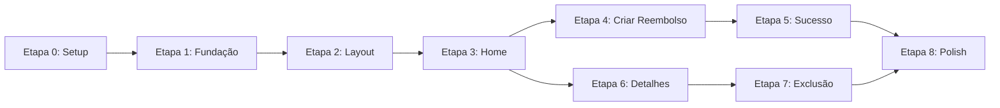

# Plano de Implementação — Sistema de Reembolso

> **Baseado em:** [PRD.md](./PRD.md)
> **Executor:** Gemini 3.1 Pro (Antigravity IDE)
> **Data:** 2026-04-09

---

## Visão Geral

Este documento descreve **8 etapas sequenciais** para implementação do Sistema de Reembolso. Cada etapa é independente e verificável — ao final de cada uma, o projeto deve compilar (`npm run build`) e o dev server deve rodar sem erros (`npm run dev`).

### Regras para o Executor (IA)

1. **Leia o PRD.md** por completo antes de iniciar qualquer etapa.
2. **Consulte o Figma MCP** (`figma-dev-mode-mcp-server`) antes de implementar qualquer tela (seção 14 do PRD).
3. **Não invente funcionalidades** — implemente apenas o que está descrito no PRD.
4. **Não crie abstrações extras** — sem camadas repository, adapter, domain, etc.
5. **Verifique o build** ao final de cada etapa com `npm run build`.
6. **Use TypeScript estrito** — tipar todas as interfaces, props e retornos.
7. **Código em inglês** — nomes de variáveis, funções e componentes em inglês. UI em português.
8. **Instale apenas as dependências listadas** no PRD seção 2.2.

### Diagrama de Dependências entre Etapas



---

## Etapa 0 — Setup do Projeto

### Objetivo

Instalar todas as dependências e configurar as ferramentas necessárias (Tailwind CSS, shadcn/ui, path aliases). Ao final, o projeto deve compilar e rodar sem erros.

### Ações

#### 0.1 Instalar dependências de produção

```bash
cd refund
npm install axios @tanstack/react-query react-hook-form @hookform/resolvers zod react-router-dom @phosphor-icons/react
```

#### 0.2 Inicializar shadcn/ui

O shadcn/ui vai configurar automaticamente o Tailwind CSS e os path aliases.

```bash
cd refund
npx shadcn@latest init
```

Durante a inicialização, selecionar:

- **Style:** Default
- **Base color:** Neutral (vamos customizar depois)
- **CSS variables:** Sim

> **Nota:** o shadcn pode pedir para configurar `tsconfig.json` com path aliases (`@/*`). Aceitar todas as sugestões.

#### 0.3 Adicionar componentes shadcn necessários

```bash
cd refund
npx shadcn@latest add button input dialog select table label badge pagination
```

#### 0.4 Configurar Google Fonts (Open Sans)

Adicionar no `index.html` dentro do `<head>`:

```html
<link rel="preconnect" href="https://fonts.googleapis.com">
<link rel="preconnect" href="https://fonts.gstatic.com" crossorigin>
<link href="https://fonts.googleapis.com/css2?family=Open+Sans:wght@400;500;600;700&display=swap" rel="stylesheet">
```

### Entregáveis

- [ ] Todas as dependências instaladas (verificar `package.json`)
- [ ] shadcn/ui inicializado (existe `components.json` na raiz)
- [ ] Componentes shadcn disponíveis em `src/components/ui/`
- [ ] Open Sans carregada via Google Fonts
- [ ] `npm run build` passa sem erros
- [ ] `npm run dev` inicia sem erros

---

## Etapa 1 — Fundação (Types, Services, Providers)

### Objetivo

Criar a infraestrutura base: tipos TypeScript, serviço HTTP (Axios), hooks do React Query, utilitários e providers globais. Nenhuma UI será construída nesta etapa.

### Ações

#### 1.1 Criar tipos TypeScript

**Arquivo:** `src/types/refund.ts`

Definir as interfaces `Refund`, `Receipt`, `PaginatedResponse` e o tipo `RefundCategory` conforme PRD seção 5.

#### 1.2 Criar serviço HTTP (Axios)

**Arquivo:** `src/services/api.ts`

- Criar instância do Axios com `baseURL: http://localhost:3333`
- NÃO criar interceptors complexos — apenas a instância base

#### 1.3 Criar funções de API

**Arquivo:** `src/services/refunds.ts`

Funções (não hooks, apenas funções puras que retornam Promises):

- `getRefunds(params: { page?: number; search?: string })` → `GET /refunds`
- `getRefund(id: string)` → `GET /refunds/{id}`
- `createRefund(data: { title, category, value, receipt })` → `POST /refunds`
- `deleteRefund(id: string)` → `DELETE /refunds/{id}`

**Arquivo:** `src/services/receipts.ts`

- `createReceipt(file: File)` → `POST /receipts` (multipart/form-data)
- `getReceiptDownloadUrl(id: string)` → retorna a URL `{baseURL}/receipts/download/{id}`

#### 1.4 Criar hooks do React Query

**Arquivo:** `src/hooks/use-refunds.ts`

- `useRefunds(page, search)` → useQuery com key `['refunds', { page, search }]`
- `useRefund(id)` → useQuery com key `['refund', id]`

**Arquivo:** `src/hooks/use-refund-mutations.ts`

- `useCreateReceipt()` → useMutation
- `useCreateRefund()` → useMutation com invalidação de `['refunds']`
- `useDeleteRefund()` → useMutation com invalidação de `['refunds']`

#### 1.5 Criar utilitários

**Arquivo:** `src/lib/formatters.ts`

- `formatCurrency(valueInCents: number): string` — conforme PRD seção 8.1
- `formatDate(isoDate: string): string` — conforme PRD seção 8.3
- `categoryLabels` — mapeamento conforme PRD seção 8.2

#### 1.6 Configurar Design System (CSS Variables)

**Arquivo:** `src/index.css` (ou o arquivo CSS global criado pelo shadcn)

Customizar as CSS variables do shadcn para usar a paleta do PRD seção 3.1:

```css
:root {
  /* Mapear cores do style guide para as variables do shadcn */
  --background: #F9FBFA;      /* gray-500 */
  --foreground: #1F2523;       /* gray-100 */
  --primary: #1F8459;          /* green-100 */
  --primary-foreground: #FFFFFF;
  /* ... demais tokens */
  --font-sans: 'Open Sans', sans-serif;
}
```

#### 1.7 Configurar React Query Provider

**Arquivo:** `src/main.tsx`

Envolver o `<App />` com `<QueryClientProvider>`.

#### 1.8 Configurar React Router

**Arquivo:** `src/App.tsx`

Configurar `<BrowserRouter>` com as 3 rotas do PRD seção 4.2:

- `/` → placeholder `<div>Home</div>`
- `/refund/success` → placeholder `<div>Success</div>`
- `/refund/:id` → placeholder `<div>Details</div>`

> **IMPORTANTE:** A rota `/refund/success` deve vir ANTES de `/refund/:id` no Router, senão "success" será interpretado como um `:id`.

### Entregáveis

- [ ] Tipos TypeScript criados e exportados
- [ ] Axios configurado com baseURL
- [ ] Funções de API implementadas (6 funções)
- [ ] Hooks React Query implementados (5 hooks)
- [ ] Utilitários de formatação implementados (3 funções)
- [ ] CSS variables customizadas com as cores do design system
- [ ] QueryClientProvider configurado no main.tsx
- [ ] BrowserRouter com 3 rotas (placeholder)
- [ ] `npm run build` passa sem erros

---

## Etapa 2 — Layout e Navegação

### Objetivo

Implementar o layout principal da aplicação: sidebar com logo e links de navegação. Este layout envolve todas as páginas.

### Pré-requisito Figma

```
Antes de implementar, executar no Figma MCP:
1. get_metadata(nodeId: "2301:388") → Identificar estrutura do layout/sidebar
2. get_screenshot(nodeId do layout) → Referência visual
3. get_design_context(nodeId do layout) → Obter medidas e espaçamentos
```

### Ações

#### 2.1 Criar componente Sidebar

**Arquivo:** `src/components/sidebar.tsx`

Elementos (conforme Figma):

- Logo da aplicação (SVG ou texto estilizado)
- Links de navegação usando `NavLink` do React Router
- Ícones do Phosphor Icons
- Estilização seguindo os estados do NavLink (PRD seção 3.4)

#### 2.2 Criar componente Layout

**Arquivo:** `src/components/layout.tsx`

- Sidebar fixa à esquerda
- Área de conteúdo principal (`<Outlet />` do React Router)
- Background `gray-500` (#F9FBFA) na área de conteúdo

#### 2.3 Integrar Layout no Router

**Arquivo:** `src/App.tsx`

Atualizar o Router para usar o `Layout` como wrapper:

```tsx
<Route element={<Layout />}>
  <Route path="/" element={<HomePage />} />
  <Route path="/refund/success" element={<RefundSuccessPage />} />
  <Route path="/refund/:id" element={<RefundDetailsPage />} />
</Route>
```

### Entregáveis

- [ ] Sidebar renderizada com logo e links
- [ ] Links mudam de estilo quando ativos (cor `green-100`)
- [ ] Ícones Phosphor visíveis na sidebar
- [ ] Layout exibe conteúdo placeholder à direita da sidebar
- [ ] Visual confere com o design do Figma
- [ ] `npm run build` passa sem erros

---

## Etapa 3 — Home Page (Listagem + Busca + Paginação)

### Objetivo

Implementar a página principal com listagem paginada de reembolsos, barra de busca com debounce e paginação funcional.

### Pré-requisito Figma

```
1. get_metadata(nodeId da Home) → Estrutura da página
2. get_screenshot(nodeId da Home) → Referência visual
3. get_design_context(nodeId da Home) → Medidas e espaçamentos
```

### Ações

#### 3.1 Criar componente da página Home

**Arquivo:** `src/pages/home.tsx`

Elementos:

- Header da seção: título "Solicitações", contador de resultados
- Barra de busca (Input com ícone `MagnifyingGlass` do Phosphor)
- Botão "Nova solicitação" (abre modal — será conectado na Etapa 4)
- Tabela de reembolsos
- Paginação

#### 3.2 Implementar tabela de reembolsos

Usar componente `Table` do shadcn. Colunas:

| Coluna | Dado | Formatação |
|---|---|---|
| Solicitação | `title` | Texto direto |
| Categoria | `category` | Traduzido via `categoryLabels` |
| Valor | `value` | Formatado via `formatCurrency()` |
| Data | `createdAt` | Formatado via `formatDate()` |
| Ação | — | Ícone `CaretRight` (link para detalhes) |

#### 3.3 Implementar busca com debounce

- Estado local `searchTerm` para o input
- Debounce de 400ms antes de passar o termo para o hook `useRefunds`
- Usar `useState` + `useEffect` com `setTimeout` para o debounce (sem bibliotecas extras)

#### 3.4 Implementar paginação

- Usar componente `Pagination` do shadcn
- Estado local `page` (inicia em 1)
- Dados de paginação vindos de `meta` na resposta da API

#### 3.5 Implementar estados visuais

- **Loading:** Spinner ou skeleton na área da tabela
- **Vazio:** Mensagem "Nenhuma solicitação encontrada" quando `data.length === 0`
- **Erro:** Mensagem com botão "Tentar novamente"

#### 3.6 Navegação para detalhes

- Clique na linha da tabela (ou no ícone de seta) navega para `/refund/:id`
- Usar `useNavigate()` do React Router

### Entregáveis

- [ ] Listagem exibe reembolsos da API com todas as colunas formatadas
- [ ] Busca filtra por nome com debounce funcional
- [ ] Paginação navega entre páginas
- [ ] Estado de loading visível durante carregamento
- [ ] Estado vazio exibido quando não há dados
- [ ] Clique em um item navega para detalhes
- [ ] Layout confere com o Figma
- [ ] `npm run build` passa sem erros

---

## Etapa 4 — Modal de Criação de Reembolso

### Objetivo

Implementar o modal com formulário validado para criar novos reembolsos, incluindo upload de recibo.

### Pré-requisito Figma

```
1. Localizar node ID do modal "Criar Reembolso" via get_metadata
2. get_screenshot(nodeId do modal) → Referência visual
3. get_design_context(nodeId do modal) → Medidas
```

### Ações

#### 4.1 Criar componente do modal

**Arquivo:** `src/components/create-refund-modal.tsx`

- Usar `Dialog` do shadcn como base
- Recebe props `open` e `onOpenChange`

#### 4.2 Implementar formulário

- Usar `react-hook-form` com `zodResolver`
- Schema de validação conforme PRD seção 7.4
- Campos:
  - **Nome da solicitação:** `Input` (shadcn) — obrigatório
  - **Valor (R$):** `Input` tipo numérico — obrigatório, > 0
  - **Categoria:** `Select` (shadcn) com as 5 opções traduzidas — obrigatório
  - **Recibo:** Input file customizado — obrigatório, JPG/PNG/PDF, ≤ 2MB

#### 4.3 Implementar input de file upload

- Input nativo `type="file"` estilizado
- Aceitar apenas: `.jpg, .jpeg, .png, .pdf`
- Validar tamanho (≤ 2MB) no schema Zod
- Exibir nome do arquivo selecionado

#### 4.4 Implementar fluxo de submissão

Seguir estritamente o fluxo do PRD seção 6.3:

1. Desabilitar botão de submit, mostrar loading
2. Chamar `useCreateReceipt.mutateAsync(file)` → obter `receipt.id`
3. Chamar `useCreateRefund.mutateAsync({ title, category, value (em centavos), receipt: receipt.id })`
4. **Sucesso:** fechar modal, navegar para `/refund/success`
5. **Erro:** exibir mensagem de erro inline no modal (não fechar)

> **ATENÇÃO:** O valor do formulário pode ser inserido pelo usuário em Reais (ex: "500.50"). Converter para centavos antes de enviar para a API (ex: 50050).

#### 4.5 Conectar botão na Home

**Arquivo:** `src/pages/home.tsx`

Conectar o botão "Nova solicitação" ao `CreateRefundModal`:

- Estado `isModalOpen` na Home
- Botão seta `isModalOpen = true`
- Modal recebe `open={isModalOpen}` e `onOpenChange={setIsModalOpen}`

### Entregáveis

- [ ] Modal abre ao clicar em "Nova solicitação"
- [ ] Formulário exibe todos os 4 campos
- [ ] Validação funciona: campos obrigatórios, tipo/tamanho do arquivo
- [ ] Mensagens de erro aparecem abaixo de cada campo inválido
- [ ] Upload do recibo é feito antes da criação do reembolso
- [ ] Valor convertido corretamente para centavos
- [ ] Após sucesso: modal fecha e redireciona para `/refund/success`
- [ ] Após erro: mensagem de erro visível no modal
- [ ] Loading indicator no botão durante submissão
- [ ] `npm run build` passa sem erros

---

## Etapa 5 — Página de Sucesso

### Objetivo

Implementar a página simples de confirmação exibida após cadastro bem-sucedido de reembolso.

### Pré-requisito Figma

```
1. Localizar node ID da tela de Sucesso via get_metadata
2. get_screenshot(nodeId) → Referência visual
3. get_design_context(nodeId) → Medidas
```

### Ações

#### 5.1 Criar página de sucesso

**Arquivo:** `src/pages/refund-success.tsx`

Elementos:

- Ícone de sucesso (usar `CheckCircle` do Phosphor Icons, tamanho grande, cor `green-100`)
- Título: "Solicitação registrada com sucesso!" (ou texto conforme Figma)
- Texto complementar (se existir no Figma)
- Botão "Nova solicitação" ou "Voltar para o início" → navega para `/`

Centralizado vertical e horizontalmente na área de conteúdo.

### Entregáveis

- [ ] Página exibe ícone, mensagem e botão
- [ ] Botão navega corretamente para a Home
- [ ] Layout confere com o Figma
- [ ] `npm run build` passa sem erros

---

## Etapa 6 — Página de Detalhes do Reembolso

### Objetivo

Implementar a página que exibe todos os dados de um reembolso específico e a visualização do recibo associado.

### Pré-requisito Figma

```
1. Localizar node ID da tela de Detalhes via get_metadata
2. get_screenshot(nodeId) → Referência visual
3. get_design_context(nodeId) → Medidas
```

### Ações

#### 6.1 Criar página de detalhes

**Arquivo:** `src/pages/refund-details.tsx`

- Usar `useParams()` do React Router para capturar `:id`
- Usar hook `useRefund(id)` para buscar dados

#### 6.2 Implementar layout dos dados

Exibir:

- Botão voltar (ícone `CaretLeft` + texto "Voltar") → navega para `/`
- Nome da solicitação (título)
- Categoria (traduzida)
- Valor (formatado em R$)
- Data de criação (formatada)

#### 6.3 Implementar visualização do recibo

- Se o recibo for imagem (JPG/PNG): exibir `` inline usando a URL `{baseURL}/receipts/download/{receipt.id}`
- Se o recibo for PDF: exibir botão/link para abrir o PDF em nova aba
- Verificar o `receipt.extname` para decidir qual exibição usar

#### 6.4 Botão de exclusão

- Botão "Excluir" visível na página
- Estilo: botão secundário/destrutivo
- Clique abre o modal de confirmação (será implementado na Etapa 7)
- Por enquanto, deixar apenas o botão com `onClick` que faz `console.log` ou abre um modal vazio

#### 6.5 Estados de loading e erro

- **Loading:** skeleton ou spinner enquanto carrega
- **Erro/404:** mensagem amigável "Solicitação não encontrada" com link para Home

### Entregáveis

- [ ] Página carrega e exibe dados do reembolso buscados da API
- [ ] Todos os campos formatados corretamente (moeda, data, categoria)
- [ ] Recibo exibido inline (imagem) ou como link (PDF)
- [ ] Botão voltar funciona
- [ ] Botão excluir presente (funcionalidade completa na Etapa 7)
- [ ] Loading state durante carregamento
- [ ] Tratamento de erro/404
- [ ] Layout confere com o Figma
- [ ] `npm run build` passa sem erros

---

## Etapa 7 — Modal de Exclusão com Confirmação

### Objetivo

Implementar o modal de confirmação para excluir um reembolso e conectar o fluxo completo de exclusão.

### Pré-requisito Figma

```
1. Localizar node ID do modal de exclusão via get_metadata
2. get_screenshot(nodeId) → Referência visual
3. get_design_context(nodeId) → Medidas
```

### Ações

#### 7.1 Criar componente do modal de exclusão

**Arquivo:** `src/components/delete-refund-dialog.tsx`

Props:

- `open: boolean`
- `onOpenChange: (open: boolean) => void`
- `refundId: string`
- `onSuccess: () => void` — callback chamado após exclusão bem-sucedida

Elementos:

- Usar `Dialog` do shadcn
- Ícone de alerta/atenção
- Título: "Excluir solicitação"
- Mensagem: "Tem certeza que deseja excluir esta solicitação? Essa ação não pode ser desfeita."
- Botão "Cancelar" → fecha o modal
- Botão "Sim, excluir" → executa exclusão

#### 7.2 Implementar fluxo de exclusão

1. Ao clicar em "Sim, excluir":
   - Desabilitar botão, mostrar loading
   - Chamar `useDeleteRefund.mutateAsync(refundId)`
   - **Sucesso:** chamar `onSuccess()`, fechar modal
   - **Erro:** exibir mensagem de erro no modal

#### 7.3 Conectar na página de detalhes

**Arquivo:** `src/pages/refund-details.tsx`

- Estado `isDeleteDialogOpen`
- Botão "Excluir" seta `isDeleteDialogOpen = true`
- `onSuccess` do dialog:
  - Navegar para `/` (`useNavigate`)
  - Cache de `['refunds']` já é invalidado pelo hook

### Entregáveis

- [ ] Modal abre ao clicar em "Excluir" na página de detalhes
- [ ] Botão "Cancelar" fecha o modal sem ação
- [ ] Botão "Sim, excluir" exclui via API
- [ ] Loading indicator no botão durante exclusão
- [ ] Após sucesso: redireciona para Home
- [ ] Após erro: mensagem de erro no modal
- [ ] Lista de reembolsos atualizada automaticamente (invalidação de cache)
- [ ] `npm run build` passa sem erros

---

## Etapa 8 — Polish e Verificação Final

### Objetivo

Revisar todos os fluxos, garantir consistência visual com o Figma, tratar edge cases e validar o build final.

### Ações

#### 8.1 Revisão visual com o Figma

Para CADA tela implementada:

```
1. get_screenshot(nodeId da tela) → Capturar referência
2. Abrir a tela no navegador (npm run dev)
3. Comparar lado a lado
4. Ajustar espaçamentos, cores, tipografia e tamanhos
```

Telas a revisar:

- [ ] Home (listagem, busca, paginação)
- [ ] Modal de criação
- [ ] Página de sucesso
- [ ] Página de detalhes
- [ ] Modal de exclusão
- [ ] Sidebar/Layout

#### 8.2 Verificar estados visuais

- [ ] **Loading:** todas as operações assíncronas mostram indicador
- [ ] **Erro:** todas as falhas de API exibem mensagem amigável
- [ ] **Vazio:** listagem sem dados exibe mensagem adequada
- [ ] **Vazio (busca):** busca sem resultados exibe mensagem diferenciada

#### 8.3 Verificar fluxos completos

Testar end-to-end (com a API rodando):

| # | Fluxo | Resultado Esperado |
|---|---|---|
| 1 | Abrir app → ver listagem | Tabela carrega com dados da API |
| 2 | Buscar por nome | Tabela filtra corretamente |
| 3 | Navegar paginação | Próxima página carrega |
| 4 | Clicar "Nova solicitação" | Modal abre |
| 5 | Submeter formulário completo | Upload + criação → redireciona para sucesso |
| 6 | Voltar da página de sucesso | Home exibe o novo reembolso na lista |
| 7 | Clicar em um reembolso | Página de detalhes carrega |
| 8 | Visualizar recibo | Imagem/PDF do recibo visível |
| 9 | Clicar "Excluir" | Modal de confirmação abre |
| 10 | Confirmar exclusão | Reembolso removido, redireciona para Home |

#### 8.4 Verificações técnicas

```bash
# Build sem erros
cd refund && npm run build

# Lint sem erros
cd refund && npm run lint
```

#### 8.5 Validações de formulário

Testar edge cases no modal de criação:

- [ ] Submeter formulário vazio → erros em todos os campos
- [ ] Arquivo > 2MB → erro de validação
- [ ] Arquivo .gif ou .bmp → erro de tipo
- [ ] Valor 0 ou negativo → erro de validação
- [ ] Formulário válido → sucesso

### Entregáveis Finais

- [ ] Todas as telas implementadas e visualmente fiéis ao Figma
- [ ] Todos os fluxos funcionando corretamente
- [ ] Build passa sem erros
- [ ] Lint passa sem erros
- [ ] Nenhuma funcionalidade extra foi adicionada além do PRD

---

## Resumo das Etapas

| Etapa | Nome | Arquivos Criados/Modificados | Complexidade |
|---|---|---|---|
| **0** | Setup do Projeto | `package.json`, `components.json`, `index.html`, `src/components/ui/*` | Baixa |
| **1** | Fundação | `types/`, `services/`, `hooks/`, `lib/`, `main.tsx`, `App.tsx`, CSS global | Média |
| **2** | Layout e Navegação | `components/sidebar.tsx`, `components/layout.tsx`, `App.tsx` | Baixa |
| **3** | Home Page | `pages/home.tsx` | Alta |
| **4** | Criar Reembolso | `components/create-refund-modal.tsx`, `pages/home.tsx` | Alta |
| **5** | Página de Sucesso | `pages/refund-success.tsx` | Baixa |
| **6** | Detalhes do Reembolso | `pages/refund-details.tsx` | Média |
| **7** | Exclusão | `components/delete-refund-dialog.tsx`, `pages/refund-details.tsx` | Média |
| **8** | Polish e Verificação | Todos os arquivos (ajustes) | Média |

---

## Referência Rápida — Comandos

```bash
# Iniciar API backend (terminal 1)
cd refund-api && npm run db:prepare && npm run dev

# Iniciar frontend (terminal 2)
cd refund && npm run dev

# Build check
cd refund && npm run build

# Lint check
cd refund && npm run lint
```

## Referência Rápida — Figma MCP

```
File Key: BN6PxmQs1hkHhbXVM8qrvJ
Node raiz: 2301:388

Ferramentas disponíveis:
- get_metadata(nodeId)        → Árvore de nós
- get_screenshot(nodeId)      → Screenshot da tela
- get_design_context(nodeId)  → Código + medidas
- get_variable_defs(nodeId)   → Tokens de design
```
