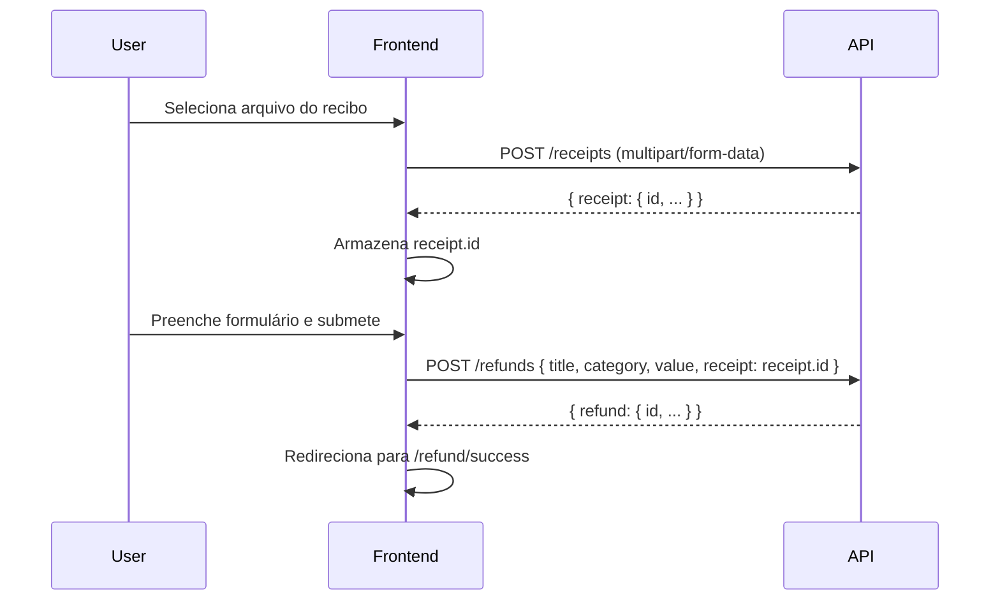

# PRD — Sistema de Reembolso

> **Versão:** 1.0  
> **Data:** 2026-04-09  
> **Status:** Aguardando aprovação

---

## 1. Visão Geral do Produto

### 1.1 Descrição

Aplicação web frontend para gestão de pedidos de reembolso e listagem de despesas empresariais. O sistema permite a criação, visualização, busca, paginação e exclusão de solicitações de reembolso, com suporte a upload de recibos (comprovantes fiscais).

### 1.2 Escopo

- **Frontend only** — a API backend (AdonisJS) já está pronta em `refund-api/`.
- CRUD de reembolsos via consumo da API REST.
- Upload de recibos (JPG, PNG, PDF ≤ 2MB).
- Busca textual pelo nome do solicitante.
- Paginação da listagem.
- Página de detalhes com visualização do recibo.
- Feedbacks visuais (sucesso, erro, loading).

### 1.3 Fora do Escopo

- Autenticação/autorização de usuários.
- Edição de reembolsos existentes.
- Dashboard analítico ou relatórios.
- Notificações push/e-mail.
- Qualquer funcionalidade não descrita na documentação do projeto.

---

## 2. Stack Tecnológica

### 2.1 Base (já configurada)

| Tecnologia     | Versão | Uso                                                |
| -------------- | ------ | -------------------------------------------------- |
| React          | 19.0.0 | Biblioteca UI                                      |
| Vite           | 8.0.0  | Build tool & dev server                            |
| TypeScript     | 5.9.3  | Tipagem estática                                   |
| React Compiler | beta   | Otimização automática via `@rolldown/plugin-babel` |

### 2.2 Dependências a Instalar

| Pacote                  | Uso                                                                            |
| ----------------------- | ------------------------------------------------------------------------------ |
| `axios`                 | Cliente HTTP para consumo da API                                               |
| `@tanstack/react-query` | Gerenciamento de estado assíncrono, cache e revalidação                        |
| `react-hook-form`       | Gerenciamento e validação de formulários                                       |
| `zod`                   | Schema de validação (integração com react-hook-form via `@hookform/resolvers`) |
| `@hookform/resolvers`   | Resolver do Zod para react-hook-form                                           |
| `react-router-dom`      | Roteamento client-side (SPA)                                                   |
| `shadcn/ui`             | Componentes de UI (via CLI)                                                    |
| `tailwindcss`           | CSS utility-first (dependência do shadcn/ui)                                   |
| `@phosphor-icons/react` | Biblioteca de ícones (conforme style guide)                                    |

> [!NOTE]
> O shadcn/ui requer Tailwind CSS como dependência. A instalação será feita via CLI do shadcn, que configura automaticamente o Tailwind e os path aliases necessários.

---

## 3. Design System

Extraído do [style_guide.png](file:///home/jlima/Projetos/refound_project/refund/style_guide.png) fornecido no projeto.

### 3.1 Paleta de Cores

#### Base (Escala de cinzas)

| Token      | Hex       | Uso                                 |
| ---------- | --------- | ----------------------------------- |
| `gray-100` | `#1F2523` | Texto primário, backgrounds escuros |
| `gray-200` | `#4D5C57` | Texto secundário                    |
| `gray-300` | `#CDD5D2` | Bordas, divisores                   |
| `gray-400` | `#E4ECE9` | Backgrounds suaves                  |
| `gray-500` | `#F9FBFA` | Background da página                |
| `white`    | `#FFFFFF` | Cards, superfícies                  |

#### Produto (Verde — cor primária)

| Token       | Hex       | Uso                                   |
| ----------- | --------- | ------------------------------------- |
| `green-100` | `#1F8459` | Botões, links ativos, ações primárias |
| `green-200` | `#2CB178` | Hover de botões, destaques            |

### 3.2 Tipografia

| Propriedade | Valor                        |
| ----------- | ---------------------------- |
| Font Family | **Open Sans** (Google Fonts) |

### 3.3 Ícones

| Propriedade | Valor                                        |
| ----------- | -------------------------------------------- |
| Biblioteca  | **Phosphor Icons** (`@phosphor-icons/react`) |

### 3.4 Componentes do Design System

Conforme style guide, os seguintes componentes base devem ser implementados:

#### Button

| Estado   | Descrição                                                  |
| -------- | ---------------------------------------------------------- |
| Default  | Fundo `green-100`, texto branco, border-radius arredondado |
| Hover    | Fundo `green-200`                                          |
| Disabled | Fundo verde claro (opacidade reduzida)                     |

#### Icon Button

| Estado   | Descrição                       |
| -------- | ------------------------------- |
| Default  | Fundo `green-100`, ícone branco |
| Hover    | Fundo `green-200`               |
| Disabled | Opacidade reduzida              |

#### Input

| Estado                | Descrição                                               |
| --------------------- | ------------------------------------------------------- |
| Empty/Default         | Borda `gray-300`, label `gray-200`, placeholder visível |
| Empty/Active (focus)  | Borda `green-100`, label `green-100`                    |
| Filled/Default        | Borda `gray-300`, texto `gray-100`                      |
| Filled/Active (focus) | Borda `green-100`, label `green-100`                    |

#### Select (Dropdown)

| Estado           | Descrição                                         |
| ---------------- | ------------------------------------------------- |
| Empty/Default    | Borda `gray-300`, placeholder "Selecione"         |
| Empty/Active     | Borda `green-100`, dropdown aberto com opções     |
| Selected/Default | Borda `gray-300`, valor selecionado exibido       |
| Selected/Active  | Borda `green-100`, item selecionado com checkmark |

**Opções do Select de Categoria:**

- Alimentação (`food`)
- Hospedagem (`hosting`)
- Transporte (`transport`)
- Serviços (`services`)
- Outros (`other`)

#### NavLink

| Estado  | Descrição                           |
| ------- | ----------------------------------- |
| Default | Texto `gray-200`                    |
| Hover   | Texto `green-100`                   |
| Active  | Texto `green-100`, indicador visual |

---

## 4. Arquitetura da Aplicação

### 4.1 Estrutura de Pastas

```
refund/src/
├── assets/              # Imagens estáticas, SVGs
├── components/          # Componentes reutilizáveis (UI primitivos)
│   └── ui/              # Componentes shadcn/ui
├── pages/               # Páginas da aplicação (1 por rota)
├── hooks/               # Custom hooks (queries, mutations)
├── services/            # Configuração do Axios e funções de API
├── types/               # Interfaces e tipos TypeScript
├── lib/                 # Utilitários (formatadores, helpers)
├── App.tsx              # Componente raiz com Router
└── main.tsx             # Entrypoint (React root)
```

> [!IMPORTANT]
> Estrutura simples e direta. Sem camadas de abstração desnecessárias como "domain", "infra" ou "adapters" — o projeto é um frontend de escopo limitado.

### 4.2 Roteamento

| Rota              | Página              | Descrição                                      |
| ----------------- | ------------------- | ---------------------------------------------- |
| `/`               | `HomePage`          | Listagem paginada com busca                    |
| `/refund/:id`     | `RefundDetailsPage` | Detalhes do reembolso + visualização do recibo |
| `/refund/success` | `RefundSuccessPage` | Mensagem de sucesso pós-cadastro               |

### 4.3 Modais (não são rotas)

| Modal                | Trigger                               | Descrição                           |
| -------------------- | ------------------------------------- | ----------------------------------- |
| `CreateRefundModal`  | Botão "Nova solicitação" na Home      | Formulário de cadastro de reembolso |
| `DeleteRefundDialog` | Botão "Excluir" na página de detalhes | Confirmação de exclusão             |

---

## 5. Modelos de Dados (TypeScript)

### 5.1 Refund

```typescript
interface Refund {
  id: string;
  title: string;
  category: "food" | "hosting" | "transport" | "services" | "other";
  value: number; // em centavos
  deletedAt: string | null;
  createdAt: string;
  updatedAt: string;
  receipt: Receipt;
}
```

### 5.2 Receipt

```typescript
interface Receipt {
  id: string;
  originalFilename: string;
  filename: string;
  path: string;
  extname: string;
  refundId: string;
  createdAt: string;
  updatedAt: string;
}
```

### 5.3 PaginatedResponse

```typescript
interface PaginatedResponse<T> {
  meta: {
    total: number;
    perPage: number;
    currentPage: number;
    lastPage: number;
    firstPage: number;
    firstPageUrl: string;
    lastPageUrl: string;
  };
  data: T[];
}
```

---

## 6. Integração com a API

### 6.1 Configuração do Axios

```
Base URL: http://localhost:3333
```

### 6.2 Endpoints Consumidos

| Método   | Endpoint                          | Uso na aplicação                       |
| -------- | --------------------------------- | -------------------------------------- |
| `GET`    | `/refunds?q={search}&page={page}` | Listagem paginada + busca              |
| `GET`    | `/refunds/{id}`                   | Detalhes do reembolso                  |
| `POST`   | `/refunds`                        | Criar reembolso (JSON body)            |
| `DELETE` | `/refunds/{id}`                   | Excluir reembolso                      |
| `POST`   | `/receipts`                       | Upload do recibo (multipart/form-data) |
| `GET`    | `/receipts/{id}`                  | Metadados do recibo                    |
| `GET`    | `/receipts/download/{id}`         | Download/visualização do recibo        |
| `DELETE` | `/receipts/{id}`                  | Excluir recibo                         |

### 6.3 Fluxo de Criação de Reembolso



> [!IMPORTANT]
> O upload do recibo deve acontecer **antes** da criação do reembolso. O `receipt.id` retornado pelo upload é enviado no body do `POST /refunds`.

### 6.4 React Query — Estratégia

| Hook               | Tipo          | Query Key                       | Endpoint               |
| ------------------ | ------------- | ------------------------------- | ---------------------- |
| `useRefunds`       | `useQuery`    | `['refunds', { page, search }]` | `GET /refunds`         |
| `useRefund`        | `useQuery`    | `['refund', id]`                | `GET /refunds/{id}`    |
| `useCreateReceipt` | `useMutation` | —                               | `POST /receipts`       |
| `useCreateRefund`  | `useMutation` | —                               | `POST /refunds`        |
| `useDeleteRefund`  | `useMutation` | —                               | `DELETE /refunds/{id}` |

**Invalidação de cache:** após criar ou excluir um reembolso, invalidar a query key `['refunds']` para atualizar a listagem automaticamente.

---

## 7. Especificação das Páginas

### 7.1 Home — Listagem de Reembolsos

**Rota:** `/`

**Elementos:**

- Sidebar com logo e navegação
- Título da seção "Solicitações"
- Barra de busca (input com ícone de lupa)
- Botão "Nova solicitação" (abre `CreateRefundModal`)
- Tabela/lista de reembolsos com colunas:
  - Nome da solicitação (`title`)
  - Categoria (label traduzido)
  - Valor (formatado em R$)
  - Data (formatada dd/MM/yyyy)
  - Ícone de seta para detalhes
- Paginação (controles de página)
- Estado vazio quando não há resultados

**Comportamentos:**

- Busca filtra por nome do solicitante via query param `q`
- Paginação via query param `page`
- Clique na linha redireciona para `/refund/:id`
- Debounce na busca (300–500ms) para reduzir chamadas à API

### 7.2 Detalhes do Reembolso

**Rota:** `/refund/:id`

**Elementos:**

- Botão voltar (navega para `/`)
- Informações do reembolso:
  - Nome da solicitação
  - Categoria
  - Valor (formatado em R$ a partir de centavos)
  - Data de criação
- Seção do recibo:
  - Preview da imagem do recibo (se JPG/PNG)
  - Link para download (se PDF)
  - Usa endpoint `GET /receipts/download/{receipt.id}`
- Botão "Excluir" (abre `DeleteRefundDialog`)

**Comportamentos:**

- Loading state enquanto carrega dados
- Tratamento de erro se reembolso não encontrado
- Após excluir: redireciona para `/` com invalidação do cache

### 7.3 Página de Sucesso

**Rota:** `/refund/success`

**Elementos:**

- Ícone/ilustração de sucesso
- Mensagem de confirmação "Solicitação de reembolso registrada com sucesso!"
- Botão para voltar à listagem

### 7.4 Modal — Criar Reembolso

**Trigger:** Botão "Nova solicitação" na Home

**Campos do formulário:**
| Campo | Tipo | Validação |
|---|---|---|
| Nome da solicitação | Input texto | Obrigatório |
| Valor | Input numérico | Obrigatório, > 0 |
| Categoria | Select | Obrigatório, uma das 5 opções |
| Recibo | File upload | Obrigatório, JPG/PNG/PDF, ≤ 2MB |

**Validação com Zod + React Hook Form:**

```typescript
const createRefundSchema = z.object({
  title: z.string().min(1, "Nome é obrigatório"),
  value: z.number().positive("Valor deve ser maior que zero"),
  category: z.enum(["food", "hosting", "transport", "services", "other"], {
    required_error: "Selecione uma categoria",
  }),
  receiptFile: z
    .instanceof(File)
    .refine((f) => f.size <= 2 * 1024 * 1024, "Arquivo deve ter no máximo 2MB")
    .refine(
      (f) => ["image/jpeg", "image/png", "application/pdf"].includes(f.type),
      "Formato aceito: JPG, PNG ou PDF",
    ),
});
```

**Fluxo de submissão:**

1. Usuário preenche o formulário e seleciona o arquivo
2. Ao submeter: upload do recibo (`POST /receipts`)
3. Com o `receipt.id` retornado, cria o reembolso (`POST /refunds`)
4. Em caso de sucesso: fecha o modal e redireciona para `/refund/success`
5. Em caso de erro: exibe mensagem de feedback no próprio modal

### 7.5 Modal — Confirmação de Exclusão

**Trigger:** Botão "Excluir" na página de detalhes

**Elementos:**

- Mensagem: "Tem certeza que deseja excluir esta solicitação?"
- Botão "Cancelar" (fecha o modal)
- Botão "Confirmar exclusão" (executa `DELETE /refunds/{id}`)

**Comportamentos:**

- Loading state no botão durante exclusão
- Após sucesso: fecha modal, redireciona para `/`, invalida cache
- Após erro: exibe mensagem de feedback

---

## 8. Formatações e Utilitários

### 8.1 Valor Monetário

A API armazena valores em **centavos** (inteiro). O frontend deve converter para exibição em Reais:

```typescript
function formatCurrency(valueInCents: number): string {
  return new Intl.NumberFormat("pt-BR", {
    style: "currency",
    currency: "BRL",
  }).format(valueInCents / 100);
}
```

### 8.2 Categorias

Mapeamento de valores da API para labels em português:

```typescript
const categoryLabels: Record<string, string> = {
  food: "Alimentação",
  hosting: "Hospedagem",
  transport: "Transporte",
  services: "Serviços",
  other: "Outros",
};
```

### 8.3 Datas

```typescript
function formatDate(isoDate: string): string {
  return new Intl.DateTimeFormat("pt-BR").format(new Date(isoDate));
}
```

---

## 9. Tratamento de Erros e Feedbacks

### 9.1 Estados de Loading

- Listagem: skeleton ou spinner na tabela
- Detalhes: skeleton na página
- Submissão de formulário: botão com loading indicator
- Exclusão: botão com loading indicator

### 9.2 Estados de Erro

- Erro na listagem: mensagem com botão "Tentar novamente"
- Erro na criação: mensagem inline no modal
- Erro na exclusão: toast ou mensagem inline
- 404 (reembolso não encontrado): mensagem amigável com link para Home

### 9.3 Estado Vazio

- Listagem sem resultados: ilustração + mensagem "Nenhuma solicitação encontrada"
- Busca sem resultados: mensagem "Nenhum resultado para '{termo}'"

---

## 10. Componentes shadcn/ui Previstos

Componentes do shadcn/ui que serão utilizados, customizados com o design system:

| Componente   | Uso                                          |
| ------------ | -------------------------------------------- |
| `Button`     | Ações primárias e secundárias                |
| `Input`      | Campos de texto do formulário e busca        |
| `Dialog`     | Modais (criar reembolso, confirmar exclusão) |
| `Select`     | Dropdown de categorias                       |
| `Table`      | Listagem de reembolsos                       |
| `Pagination` | Controles de página                          |
| `Label`      | Labels dos campos de formulário              |
| `Badge`      | Tags de categoria                            |

> [!NOTE]
> Os componentes shadcn serão **customizados via CSS variables** para seguir a paleta de cores e tipografia definidas no style guide (seção 3).

---

## 11. Critérios de Aceitação

### Feature 1: Listagem de Reembolsos

- [ ] Exibe lista paginada de reembolsos (10 por página, conforme API)
- [ ] Mostra título, categoria (traduzida), valor (R$) e data
- [ ] Paginação funcional com indicação da página atual
- [ ] Clicar em um item navega para os detalhes

### Feature 2: Busca

- [ ] Input de busca filtra por nome do solicitante
- [ ] Busca via query param `q` na API
- [ ] Debounce aplicado para evitar chamadas excessivas
- [ ] Exibe estado vazio quando sem resultados

### Feature 3: Criar Reembolso (Modal)

- [ ] Modal abre ao clicar no botão "Nova solicitação"
- [ ] Formulário com campos: nome, valor, categoria, recibo
- [ ] Validação de todos os campos (obrigatórios)
- [ ] Validação do arquivo: tipo (JPG/PNG/PDF) e tamanho (≤ 2MB)
- [ ] Upload do recibo antes da criação do reembolso
- [ ] Valor enviado em centavos para a API
- [ ] Redireciona para página de sucesso após criação

### Feature 4: Página de Sucesso

- [ ] Exibe mensagem de confirmação
- [ ] Botão para retornar à listagem

### Feature 5: Detalhes do Reembolso

- [ ] Exibe todas as informações do reembolso
- [ ] Exibe o recibo (imagem inline ou link para PDF)
- [ ] Botão voltar funcional

### Feature 6: Exclusão com Confirmação

- [ ] Modal de confirmação ao clicar em "Excluir"
- [ ] Exclui o reembolso via API ao confirmar
- [ ] Redireciona para Home após exclusão
- [ ] Invalida cache da listagem (React Query)

### Feature 7: Feedbacks Visuais

- [ ] Loading states em todas as operações assíncronas
- [ ] Mensagens de erro amigáveis
- [ ] Estados vazios com mensagem adequada

### Feature 8: React Query

- [ ] Todas as chamadas GET usam `useQuery`
- [ ] Todas as chamadas POST/DELETE usam `useMutation`
- [ ] Cache invalidado corretamente após mutações
- [ ] Atualização automática da listagem ao voltar da criação/exclusão

---

## 12. Plano de Verificação

### 12.1 Verificação Manual

1. **API rodando:** executar `npm run db:prepare` e `npm run dev` em `refund-api/`
2. **Frontend rodando:** executar `npm run dev` em `refund/`
3. Testar cada fluxo:
   - Criar reembolso com upload → verificar redirecionamento para sucesso
   - Voltar à listagem → verificar que o novo reembolso aparece
   - Buscar por nome → verificar filtro
   - Navegar paginação → verificar troca de página
   - Abrir detalhes → verificar dados e recibo
   - Excluir reembolso → verificar confirmação e remoção da lista

### 12.2 Build Check

```bash
cd refund && npm run build
```

O build deve completar sem erros de TypeScript ou Vite.

### 12.3 Lint Check

```bash
cd refund && npm run lint
```

---

## 13. Princípios de Desenvolvimento

> [!IMPORTANT]
>
> - **Clean Code:** código conciso, autoexplicativo, sem comentários óbvios
> - **Sem over-engineering:** implementar apenas o que está documentado
> - **Sem abstrações prematuras:** não criar camadas extras (repository, adapter, etc.)
> - **TypeScript estrito:** tipagem em todas as interfaces e props
> - **Componentes focados:** cada componente faz uma coisa bem feita
> - **Hooks customizados:** encapsular lógica de API em hooks reutilizáveis

---

## 14. Referência de Design — Figma MCP

> [!IMPORTANT]
> O design das telas **DEVE** ser implementado seguindo fielmente o projeto Figma. O acesso ao design é feito via **Figma MCP Server** (`figma-dev-mode-mcp-server`).

### 14.1 Link do Projeto Figma

```
https://www.figma.com/design/BN6PxmQs1hkHhbXVM8qrvJ/Sistema-de-reembolso--Community-?node-id=2301-388&m=dev
```

- **File Key:** `BN6PxmQs1hkHhbXVM8qrvJ`
- **Node ID raiz:** `2301:388`

### 14.2 Regras de Uso do Figma MCP

1. **Antes de implementar qualquer tela ou componente**, consultar o design no Figma via `get_design_context` usando o `nodeId` correspondente.
2. **Usar `get_metadata`** para explorar a árvore de nós e identificar os IDs de cada tela/componente.
3. **Usar `get_screenshot`** para capturar referência visual ao implementar.
4. **Usar `get_variable_defs`** para extrair tokens de design (cores, espaçamentos, tipografia) diretamente do Figma.
5. **O Figma é a fonte de verdade** para layout, espaçamentos, tamanhos, cores e hierarquia visual. O style guide (seção 3) serve como referência rápida, mas em caso de conflito, **o Figma prevalece**.

### 14.3 Workflow de Implementação por Tela

Para cada página/componente a ser implementado:

```
1. get_metadata(nodeId) → Entender a estrutura da tela
2. get_screenshot(nodeId) → Capturar referência visual
3. get_design_context(nodeId) → Obter código de referência e metadados
4. get_variable_defs(nodeId) → Extrair tokens de design
5. Implementar seguindo os dados obtidos
6. Comparar visualmente o resultado com o screenshot do Figma
```

### 14.4 Telas no Figma

| Tela | Descrição | Ação |
|---|---|---|
| Home | Listagem de reembolsos com sidebar | Consultar via `get_metadata` no node `2301:388` |
| Detalhes | Página de detalhes do reembolso | Localizar node ID via `get_metadata` |
| Modal Criar | Formulário de novo reembolso | Localizar node ID via `get_metadata` |
| Modal Excluir | Confirmação de exclusão | Localizar node ID via `get_metadata` |
| Sucesso | Página de sucesso pós-cadastro | Localizar node ID via `get_metadata` |

> [!NOTE]
> Os node IDs específicos de cada tela devem ser descobertos explorando a árvore do Figma com `get_metadata` a partir do nó raiz `2301:388`.
